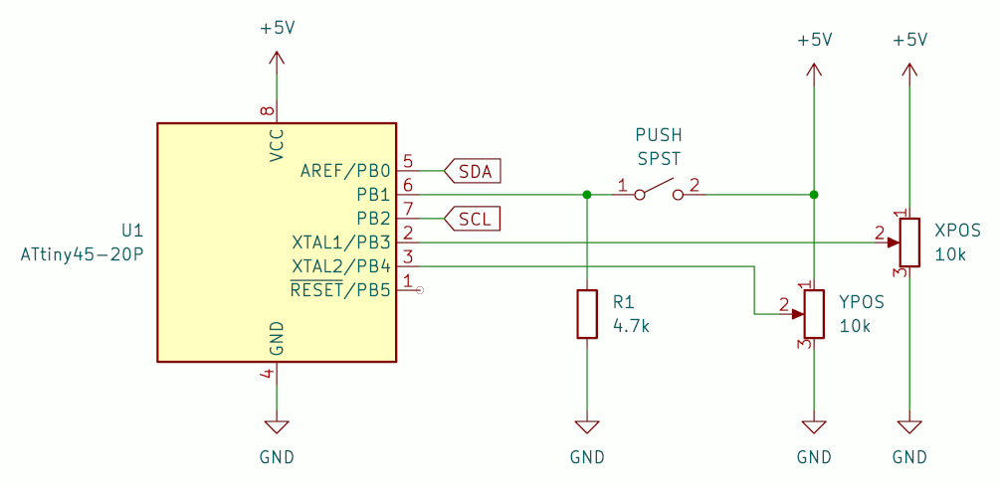

# ATtiny based i2c Joystick

This reads the analogue inputs from two potentiometers and one digital switch, and transmits this data as a single byte over i2c.

This relies on TinyWireS, specifically [svoisen's version](https://github.com/svoisen/TinyWire)
Further details on i2c with the ATtiny can be found there and on [rambo's tinywire](https://github.com/rambo/TinyWire)

*Wiring diagram*

 

### ADC
The controller requires two ADC conversions. For absolute simplicity I'm only using half the register for an 8-bit conversion. These have to be set manually and forced to wait, or the code will only return 0x00 for one or more conversions.

A centre deadzone is set so slight movements and jitter do give a reading.

 

### i2c Data
To minimise data transmission, everything is sent encoded within a single byte. At this point I only care about an absolute value, eg. *has the joystick been moved up? or left? or the button pressed?* It is very easy though to send the actual reading as a whole byte (and this is also why its useful to only do an 8-bit conversion).

The sent byte is 5 bits plus padding:
| LEFT_FLAG | RIGHT_FLAG | UP_FLAG | DOWN_FLAG | BUTTON_FLAG | 
The i2c master can simply bit compare to get the current position of the joystick

### Alternative i2C Data
3 bytes are sent:
    1a. Start nibble  0xA (0b1010)
    1b. Switch nibble 0xF (on) or 0x0 (off)
    2. X position byte
    3. Y position byte

A start nibble can be omitted but I have concerns about the master system losing sync as to which byte is being read. This just adds a way to check.

 

### Fuses
I've used a TL866II rather than AVR and set the following fuses *only*:
    - SUT0=0
    - CKSEL3=0
    - CKSEL2=0
    - CKSEL0=0
    - RSTDISBL=0